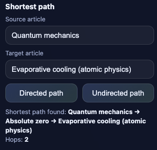
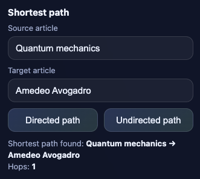
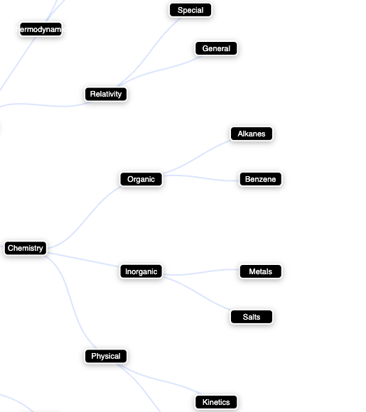

**WikiGraph**
A Python-based Wikipedia graph explorer that crawls Wikipedia articles, builds a directed graph, and visualizes relationships and shortest paths between topics.

**--------------------------------------------------------------**

**Features**
- Wikipedia crawler that builds a directed graph
- Interactive graph visualization in browser
- Shortest path between any two articles
- BFS-based subgraph extraction

**How to Run**
python3 main.py \
  --seed "Quantum mechanics" \
  --depth 2 \
  --source "Quantum mechanics" \
  --target "Atom" \
  --open

**Tech Stack**
Python 🐍
NetworkX
SQLite
vis-network (JS)
HTML/CSS/JS frontend
